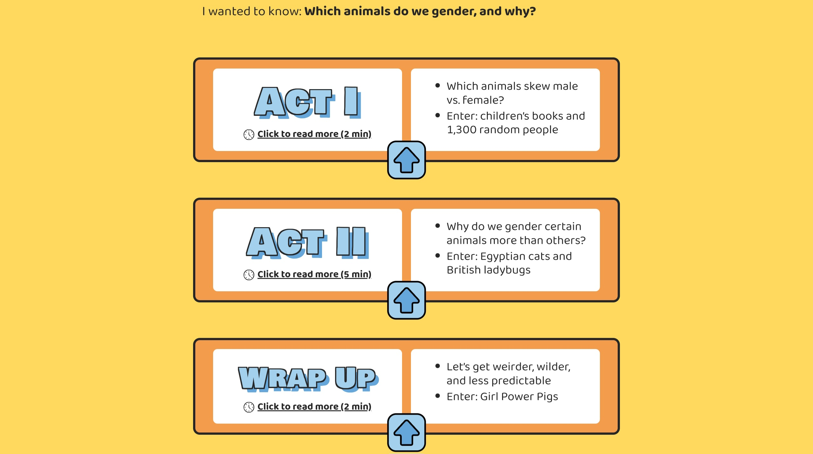
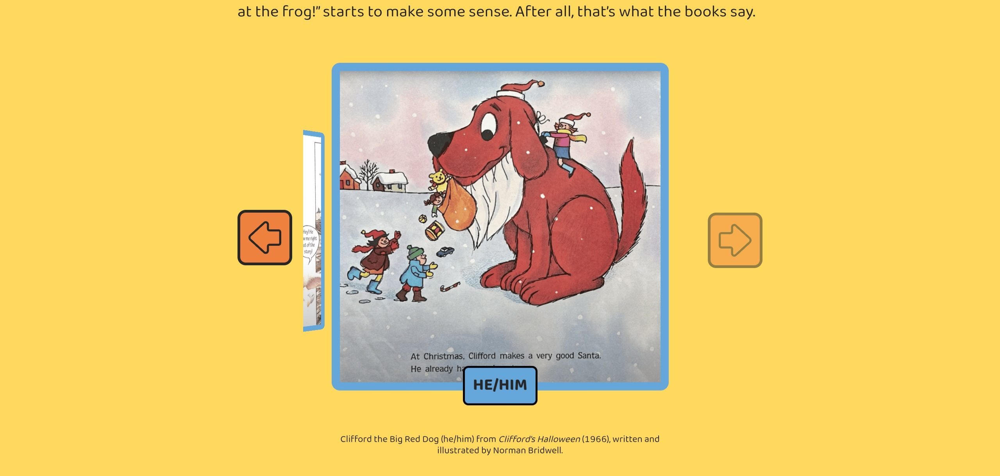
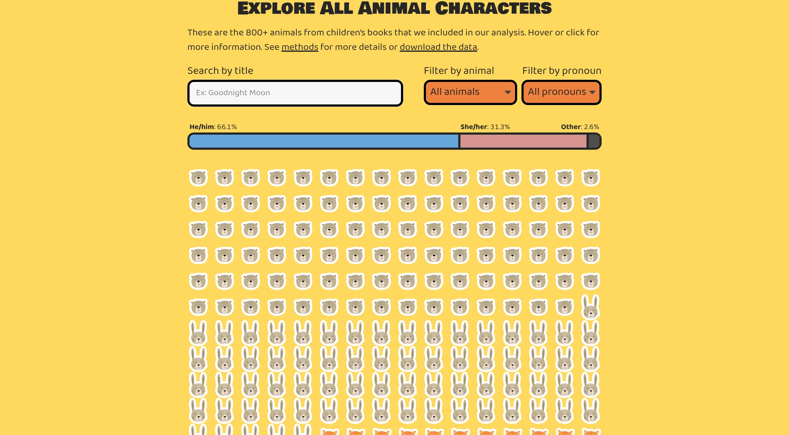
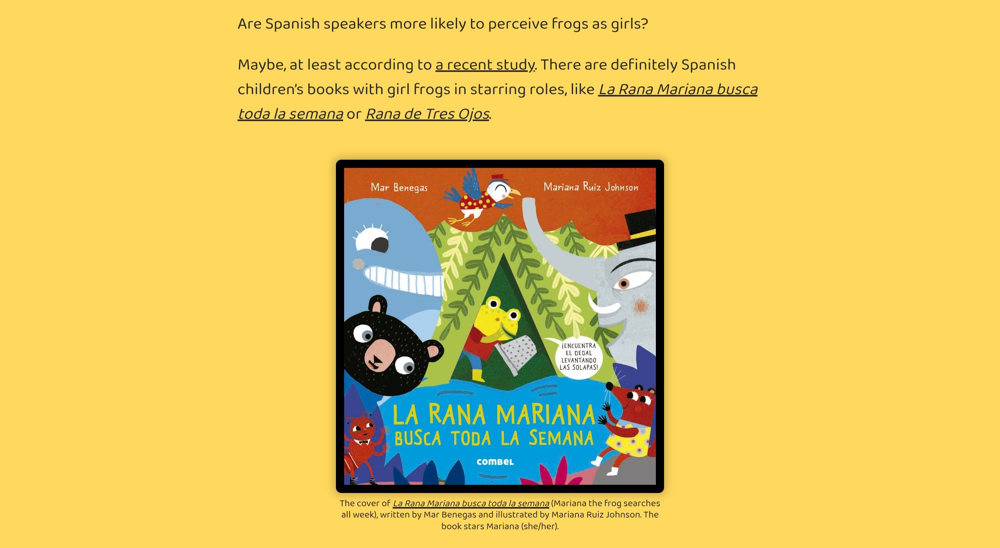
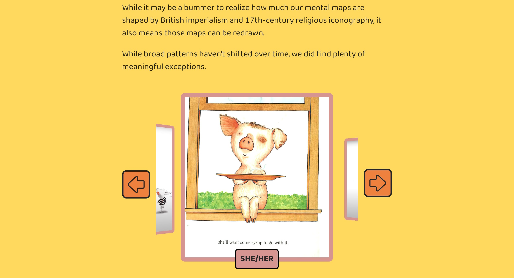

# Análisis de la Webstory "Bears Will Be Boys"
## *Por Millaray La Paz* ##
Su **estructura narrativa** está muy bien compuesta y funciona excelente. Parte planteando las preguntas que les llevó formular la hipótesis clave del reporteo, y a través de eso, va dividiendo la información en  “**Acto 1… Acto 2… etc.**”, lo cual encontré muy original y divertido, ya que es como si realmente uno estuviera leyendo un cuento infantil.

A primera vista, es súper atractivo. Al ser un estudio basado en datos de temática infantil,  está muy bien pensado para atraer y representar a este público infantil. Con **colores llamativos y una interacción juguetona**. 
Cuenta con mucha interacción llamativa. Me encantó que, sobre todo al momento de poner ejemplos que sustentan su hipótesis, **siempre** ponían imágenes de los personajes de cuentos infantiles donde utilizan un género específico para el animal. 

Usó gráficos, **muy visuales**, para ejemplificar los datos recolectados, y lo hizo junto a una estética muy amistosa, siguiendo la línea infantil (**poco dato, más color y animación**). Además, encontré muy verosímil que, para aportar a su estudio, hicieron un experimento que les permitiría saber cómo las personas le asignaban el género al personaje/animal.

Después, el resultado de ese experimento, lo usaron para comparar y reafirmar la información que ya habían planteado en un inicio. Con esto, también se utilizó un gráfico/barra de porcentajes, que demostraba la cantidad de veces que se usaba un pronombre en específico. Siendo esta **la parte más interactiva (y divertida)** porque me da la opción de buscar, según un filtro de _animal y/o pronombre_, para ver cuántas veces es utilizado en los libros infantiles. 

También, expone el porcentaje mayoritario del género que se repite en los cuentos infantiles (el masculino) y proporciona una mirada interesante respecto a la **ausencia del género femenino protagónico** en aquellas historias, y porqué le asignamos cierto género a cierto tipo de animal. 
A esto,  se le suma una comparación muy interesante entre cómo se percibe el género de los animales dentro los distintos idiomas, sobre todo el _español vs el inglés_.

Enriqueció el reporteo dar datos adicionales, como son los casos de animales que, con el tiempo, ha cambiado su percepción de género (_el_ cerdito / _la_ cerdita).

Por último, cierra la web con “**Datos y métodos**”, donde transparenta todo el proceso de recopilación y construcción de datos para sostener la hipótesis. (uso de GitHub, selección de libros, identificación de género, elección de animales, etc). Los datos tienen una buena base de estudio, acorde al tema, ya que si hablará de libros es factible, completamente, basarse en la aplicación para lectores “_**Goodreads**_”.

Webstory: https://pudding.cool/2025/07/kids-books/
